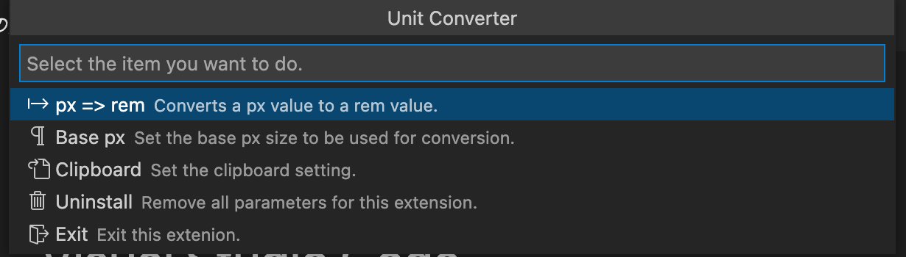

# Unit Converter

   

Convert and display size units.

## Usage1
### Step1.
Press '`⇧⌘P`' to bring up the command pallete and enter '`Unit Converter`'.

### Step2.
Select what you want to do from the menu.

## Usage2
### Step1.
Press '`⇧⌘P`' to bring up the command pallete and enter '`Unit Converter - p2r`'.

### Step2.
Enter the px value you want to convert to rem.

## Feature
### Convert px to rem
Enter the px value you want to convert to rem.

The conversion result is displayed and the value is copied to the clipboard.
\* It can also set it to not copy to the clipboard.

### Uninstall
Didn't like this extension?

Sorry for not being able to help you.

Let's uninstall it and erase all settings related to this extension.

It won't pollute your environment.

## Cautions
### How will this extension affect your environment?
This extension will make changes to the following one files.

1. settings.json
